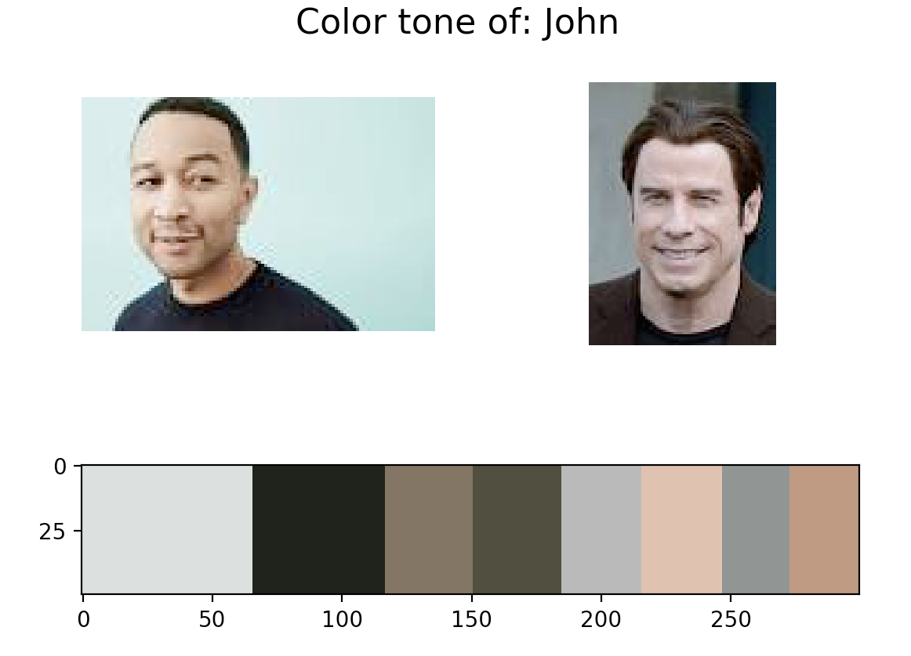
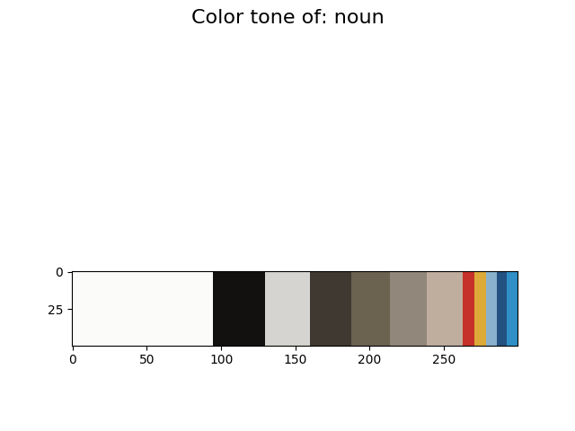
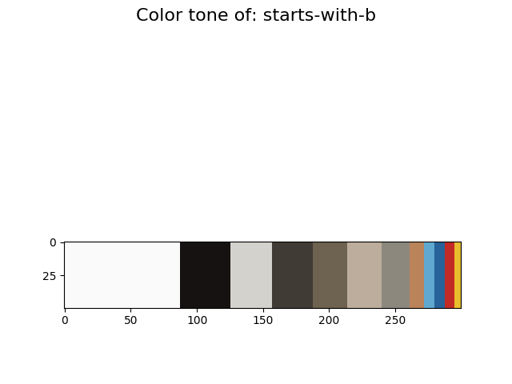

Note :

This is a python app that displays the color tone of a text. The process of transforming text to color works as follows:

1. Use Google search API to search images using the text as the query.
2. Obtain from the search thumbnails (currently 6 by default) of the text.
3. Use KNN (K nearest neighbors) algorithm on the thumnails to get colors (5 by default) that best represent the pixel concatenation.
4. Display the colors (called collectively as color tone) using matplotlib.

You can call it through bash:

```bash
python3 get_color_tone.py Groot
python3 get_color_tone.py Snack
python3 get_color_tone.py Terminal
python3 get_color_tone.py John
```

Here are some example usage snapshots:

 

 

Most of the app logic is in downloader/ and process/.

Note that you will need your own google API key to be able to run the app. The app by default tries to read it from google-api-key.txt -- If you want to try this on your own machine, make you you get a Google Custom Search API key.

After finishing the first part, we decided to find the color tone of each word category in dictionary.

1. We narrow down our search to the 30,000 most used words. The logic is that if a word is too obsecure, the picture might not be accurate.
2. We search and download 8 thumbnails for each word. Since this is a large number of queries and downloads, we decided to do them in the cloud. This really pays off because digital ocean cloud has super fast connection to Google API.
3. We seperate those words into groups such as adjective, noun, verb, alphabet starts with A, first consonant sound is B, and first vowel sound is OW. We do this using pronunciation dictionary nltk.corpus.cmudict and lemma dictionary nltk.corpus.wordnet.
4. Using the concatenated pixel list of each group, we use KNN to find its representative color tone.

The result of the dictionary search is, sadly, quite inconclusive (and not that cool). The color tone turns out to be quite the same for each group. I guess if one wants to do a serious study, one must compare the relative amount of each color in a word group, rather than finding a representive color group.

Most word group color tones contain a large portion of white color, followed by black, followed by grey,followed by different shades of brown, and then followed by more vibrant colors. I believe black and white appear a lot because it is the most commonly used background color. Brown is the color of the ground and wood and also skin tone. 

Another problem might be that nltk.corpus.wordnet treats word differently than we generally do. Without context, it considers the word run and walk both a noun and a verb. Downtown and home are considered noun, adjective, and adverb.

 

 

 

Python Library Dependencies: scikit, matplotlib, opencv(cv2), requests, nltk